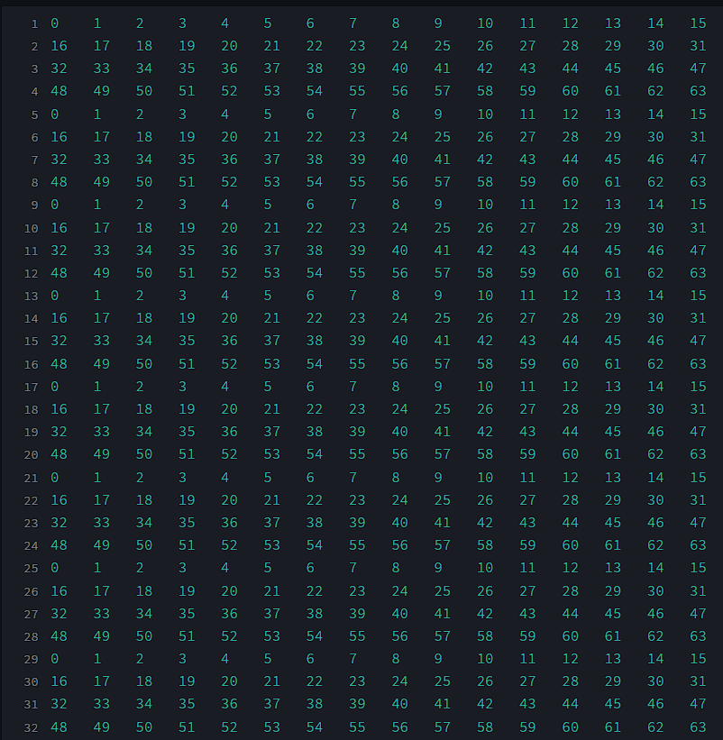
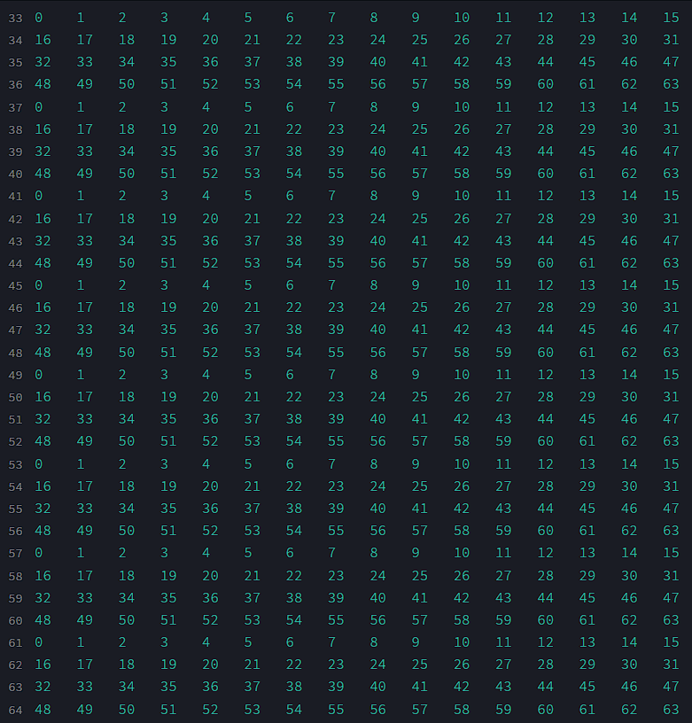

# CSARCH2_S11_GRP12
Cache Simulation Project for CSARCH2 made by Group 12 of Section S11

## Access Link
[Web Application](https://csarch2s11grp12.streamlit.app/)

## Demo Video
[Demo Video](https://drive.google.com/file/d/1jlmixLLT2NWV2m8qQMv-LfvZki6iYtx9/view?usp=sharing)

Group Members:
* [CLEMENTE, ANDRES FRONDA](https://github.com/piptxt)
* [CULANAG, SAIMON RUSSEL WOODS](https://github.com/Sai-RWC)
* [FUENTESPINA, AIAN JAMES TAYAG](https://github.com/4thDimensionDuck)
* [MAPUA, RAMON ANTONIO LUIS HARPER](https://github.com/ramonmapua)

This Cache Simulation Project was built using the Python programming language and libraries listed below.
This project is built to accurately emulate cache interactions, enabling users to gain insights into the following values:
1. Memory access count
2. Cache hit count
3. Cache miss count
4. Cache hit rate
5. Cache miss rate
6. Average memory access time
7. Total memory access time
   
This project also has the option to display the cache memory snapshot in a step-by-step visualization or a final view of the memory.

## Dependencies:
This project has the following dependencies:

* **Streamlit** - in order to host this application through the internet, this project utilizes the Streamlit library.
* **Doubly Ended Queue** - Used to simulate memory and cache.
* **random** - in order to randomly generate blocks for test cases, random was imported.

## Common Specifications:
This project has the following specifications:
1. Number of cache blocks = **32 blocks** 
2. Cache line = **16 words** 
3. Read policy: **non load-through** 
4. Number of memory blocks = **user input**
5. Type of cache memory = **direct mapping**
   
## Test Cases and Analysis:

### Test Case 1:
* up to 2n cache block. Repeat the sequence four times. Example: 0,1,2,3,…,2n-1 {4x} 

**Main Memory: 8 Blocks**

**Cache**

1. The data on our main memory looks like that because  **2(32) == 64**. The pattern is simply sequential and since there are **16 words per block**, therefore: 
* ***main memory block 1** takes data 0-15 
* ***main memory block 2*** takes data 16-31
* ***main memory block 3*** takes data 31-47
* ***main memory block 4*** takes data 48-63

Ultimately, the pattern of the data goes: 
* ***block# % 4 == 1*** gets data 0-15
* ***block# % 4 == 2*** gets data 16-31
* ***block# % 4 == 3*** gets data 32-47
* ***block# % 4 == 0*** gets data 48-63

2. To get each ***memory block's*** corresponding ***cache block***, all we have to do is modulo each ***memory block's*** from 1-64 by the number of ***cache blocks (32)***. Therefore we get:
* **1 % 32 == 1**
* **2 % 32 == 2** 
.
.
. 
* continue sequentially till we get to **64 % 32 == 0**

3. The reason why the test Main Memory and Cache Memory looks the same is because the sequence of data in MM block 1-32 is the same as 33-64. Moreover, the same applies for the hit rate (512/1024) and miss rate (512/1024).  

### Test Case 2:  

### Test Case 3: 
Mid-repeat blocks: Start at block 0, repeat the sequence in the middle two times up to n-1 blocks, after
which continue up to 2n. Then, repeat the sequence four times.

