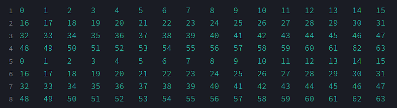

# CSARCH2_S11_GRP12
Cache Simulation Project for CSARCH2 made by Group 12 of Section S11

## Access Link
[Webapp](https://csarch2s11grp12.streamlit.app/)

Group Members:
* [CLEMENTE, ANDRES FRONDA](https://github.com/piptxt)
* [CULANAG, SAIMON RUSSEL WOODS](https://github.com/Sai-RWC)
* [FUENTESPINA, AIAN JAMES TAYAG](https://github.com/4thDimensionDuck)
* [MAPUA, RAMON ANTONIO LUIS HARPER](https://github.com/ramonmapua)

This project is built to accurately emulate cache interactions, enabling users to gain insights into the following values:
1. Memory access count
2. Cache hit count
3. Cache miss count
4. Cache hit rate
5. Cache miss rate
6. Average memory access time
7. Total memory access time
   
This project also has the option to display the cache memory snapshot in a step-by-step visualization or a final view of the memory.

## Dependencies:
This project has the following dependencies:

* **Streamlit** - in order to host this application through the internet, this project utilizes the Streamlit library.
* **Doubly Ended Queue** - Used to simulate memory and cache.
* **random** - in order to randomly generate blocks for test cases, random was imported.

## Common Specifications:
This project has the following specifications:
1. Number of cache blocks = **32 blocks** 
2. Cache line = **16 words** 
3. Read policy: **non load-through** 
4. Number of memory blocks = **user input**
5. Type of cache memory = **direct mapping**
   
## Test Cases and Analysis:

### Test Case 1:
* up to 2n cache block. Repeat the sequence four times. Example: 0,1,2,3,…,2n-1 {4x} 

**Main Memory: 8 Blocks**

**Cache**

### Test Case 2:  

### Test Case 3: 

